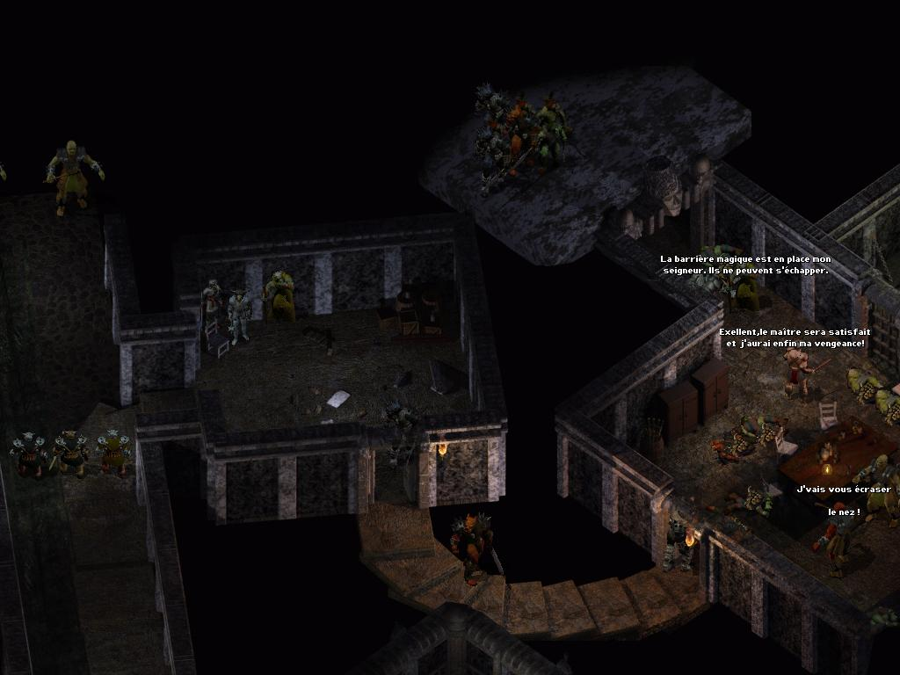
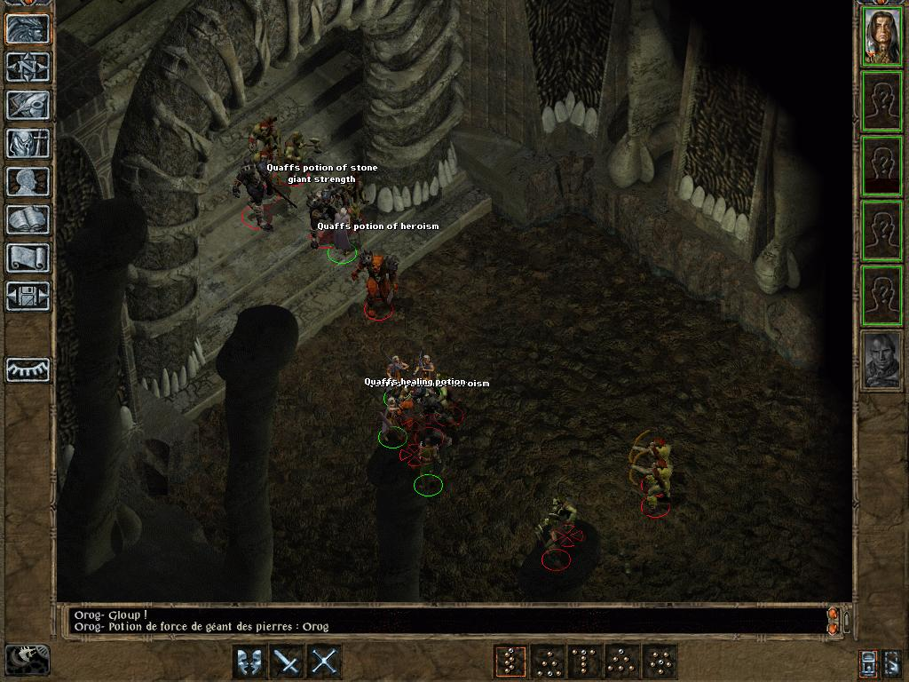

<a name="top" id="top">

 / )

<h1>Mymod</h1>

<h3>A <a href="https://www.baldursgateworld.fr">La Couronne de Cuivre</a> mod for Baldur's Gate II:ToB, Baldur's Gate Trilogy, BG2:EE and EET<h3>

 

**Author:** <a href="https://www.baldursgateworld.fr/lacouronne/Auteur.html">bibi</a>  
**Languages:** <a href="README.md">French</a>, English  
**Mod Website and Forum:** <a href="https://www.baldursgateworld.fr/lacouronne/mymod/">Mymod</a>  

## 

[Read the mod's readme](https://gwendolynefreddy.github.io/docs/lcc/readme-lcc-en.html)

[Download the mod at La Couronne de Cuivre]() 

## 

<a href="#intro">Overview</a> &#8226; <a href="#compat">Compatibility</a> &#8226; <a href="#installation">Installation</a> &#8226; <a href="#components">Components</a> &#8226; <a href="#images">Screenshots</a> &#8226; <a href="#credits">Credits and Acknowledgements</a> &#8226; <a href="#versions">Version History</a> 

## Overview

Courte description du mod : Ce mod... ou L'objet de ce mod...

Il s'agit d'un modèle de fichier readme pour GitHub destiné aux mods développés et/ou publiés sur la Couronne de Cuivre. Il est écrit en langage Markdown. Bien qu'il soit assez proche du langage HTML, certains formatages ne sont pas pris en compte par GitHub, comme l'affichage des couleurs.

Pour chaque section, j'ai repris, chaque fois que c'était possible, des éléments de traductions déjà publiées (par les d'Oghms ou par bibi) afin de conserver un semblant d'homogénéité dans les termes employés. Il suffit alors de conserver celles dont on a besoin (liste des jeux compatibles, procédures d'installation selon la plateforme, liste des outils utilisés...) et, pour le reste, de remplacer MYMOD et Auteur par le nom du mod et de son auteur, de modifier les liens et de remplir les textes adéquats. Pour certaines sections, j'ai été le plus exhaustif possible : il vous suffit de choisir les paragraphes qui vous intéressent et de supprimer les autres. &#128521;

Malheureusement, le rendu d'un fichier .md n'est véritablement effectif que dans GitHub, ce qui ne vous permet pas de visualiser votre mise en page dans Notepad++. Il existe cependant plusieurs utilitaires vous permettant de les éditer et de visualiser partiellement vos modifications. Partiellement parce que certaines balises comme [br (break line)] apparaissent à l'écran MÊME si elles resteront invisibles dans GitHub. Personnellement, j'ai opté pour <a href="https://typora.io/">Typora</a>, mais il en existe d'autres. 

&nbsp;

**Key features:**
- Feature #1
- Feature #2
- Feature #3
- Feature #4
- ...

&nbsp;

CLICK ME

#### yes, an hidden code block!

Deux listes de codes de smileys et d'emoji utilisables par markdown :
- <a href="https://gist.github.com/rxaviers/7360908">Complete list of github markdown emoji markup</a>.
- <a href="https://github.com/StylishThemes/GitHub-Dark/wiki/Emoji">GitHub-Dark Emoji (All GitHub Emoji)</a>.

<ins>Voici comment souligner un texte</ins>

 

&nbsp;

&#9755; **Note:** If you want to use more complex formating, please have a look <a href="https://github.com/GwendolyneFreddy/Infinity-Animations">here</a> and <a href="https://github.com/SpellholdStudios/1pp">there</a>. 

<a href="#top">Back to top</a>

## Compatibility

#### Games supported

This mod is designed to work on the following Infinity Engine games:
- The series of Enhanced Editions published by Beamdog, which at present includes Baldur's Gate: Enhanced Edition (BGEE), Baldur's Gate II: Enhanced Edition (BG2EE), Icewind Dale: Enhanced Edition (IWDEE), and Planescape: Torment: Enhanced Edition (PsTEE). The BGEE Siege of Dragonspear expansion (SoD) is supported as well. All of the Enhanced Edition games include the original expansion packs, e.g. IWDEE includes Heart of Winter and Trials of the Luremaster.
- The original Baldur's Gate (BG), with or without the Tales of the Sword Coast (TotSC) expansion.
- The original Baldur's Gate II (BG2, or just SoA), with or without the Throne of Bhaal (ToB) expansion. *Make sure you have Throne of Bhaal patched to version 26498. Check the ReadMe files related to your patch in your game folder and the <a href="http://www.bioware.com/games/throne_bhaal/support/patches/">BioWare</a> website if necessary.*
- The conversion projects <a href="http://www.shsforums.net/forum/261-bgt-weidu/">Baldur's Gate Trilogy</a> (BGT), <a href="https://www.pocketplane.net/bg1tutu/">Baldur's Gate Tutu</a> (Tutu), Icewind Dale-in-Baldur's Gate II (IWD-in-BG2), and <a href="https://github.com/K4thos/EET/releases">Enhanced Edition Trilogy</a> (EET).
- The original Icewind Dale (IWD) with or without either of its expansions, Heart of Winter (HoW) and Trials of the Luremaster (TotLM).
- Icewind Dale II (IWD2).
- Planescape: Torment (PsT).

## 

#### Other Mods Compatibility

Mymod is a WeiDU mod, and therefore should be compatible with all WeiDU mods. [facultatif : It has been tested on several different installations, and has so far worked perfectly.] However, we cannot test every single one. [Choisir une formule parmi les suivantes :] If you do encounter any bugs, please contact <a href="https://www.baldursgateworld.fr/lacouronne/Auteur.html">AUTHOR</a> or alternatively post on the forums. If you encounter any bugs, please report them on the forum!

Though I am striving to make it compatible with as many other mods as possible, there is always a chance that incompatibilities will arise. Below are the ones discovered thus far:
- mod 1
- mod 2
- ...

If you encounter any bugs, please report them on the forum! 

## 

#### Installation Order

>Although it is not required for the mymod to function properly, BG2 and TOB players are strongly recommended to download and install the latest version of the <a href="http://www.gibberlings3.net/bg2fixpack/">BG2 Fixpack</a> before proceeding with the installation of this mod. 

- Please install mymod before mod A.
- Please install mymod after mod B.
- ...

<a href="#top">Back to top</a>

## Installation

#### Notes

*If you've previously installed the mod, remove it before extracting the new version. To do this, run __`setup-mymod.exe`__ (or .command with OS X), un-install all previously installed components and delete both :file_folder: __mymod__ folder and __setup-mymod.exe__ file.*

*When installing or un-installing, __do not close the DOS window__ by clicking on the __X__ button! Instead, press the __Enter__ key whenever instructed to do so.*

*__Disable any antivirus__ or other memory-resident software before installing this or any other mod. Some (particularly avast and Norton!) have a tendency to report false positives with mod activity, resulting in failed installs.*

## 

#### Special Note for Siege of Dragonspear from Steam/GOG

Good Old Games (GOG) and Steam both package the additional content for Siege of Dragonspear in a method that WeiDU, the tool used to install this mod, cannot access. You must run a program called <a href="https://github.com/Argent77/A7-DlcMerger/releases/latest">DLC Merger</a> on your SoD installation before you can install this or any other WeiDU-based mod.

## 

#### Enhanced Editions Note

The Enhanced Editions are actively supported games. Please note that every patch update will wipe your current mod setup! If in the middle of a modded game you might want to delay the patch update (if possible) as even after reinstalling the mods, you might not be able to continue with your old savegames. Alternatively, copy the whole game's folder into a new one that can be modded and will stay untouched by game patches. It is important that you install the mod to the language version you are playing the game in. Otherwise, the dialogues of the mod will not show but give error messages.

## 

#### Windows

Mymod for Windows is distributed as an extractable compressed archive and includes a WeiDU installer.

Extract the contents of the mod archive into the folder of the game you wish to modify (*the folder which contains the "CHITIN.KEY" file*), using <a href="https://www.7-zip.org/download.html">7zip</a>, <a href="https://www.rarlab.com/download.htm">WinRAR</a>, <a href="https://zipgenius.com/">ZipGenius</a>, or another file compression utility that handles .zip files. On successful extraction, there should be a :file_folder: mymod folder and a setup-mymod.exe file in your game folder. To install, simply double-click **`setup-mymod.exe`** and follow the instructions on screen.

Run **`setup-mymod.exe`** in your game folder to reinstall, un-install or otherwise change the components settings.

## 

#### Mac OS X

Mymod for Mac OS X is distributed in the same compressed archive and includes a WeiDU installer.

First, extract the files from the archive into your game directory. On successful extraction, there should be a :file_folder: mymod folder, setup-mymod and setup-mymod.command files in your game folder. To install, simply double-click **`setup-mymod.command`** and follow the instructions on screen.

Run **`setup-mymod.command`** in your game folder to reinstall, un-install or otherwise change the components settings.

## 

#### Linux

Mymod for Linux is distributed in the same compressed archive and does not include a WeiDU installer.

Extract the contents of the mod to the folder of the game you wish to modify.

Download the latest version of WeiDU for Linux from <a href="https://github.com/WeiDUorg/weidu/releases">WeiDU.org</a> and copy weidu, weinstall and tolower to `/usr/local/bin` (create it if needed). Following that, open a terminal, **`cd`** to your game installation directory, run **`/usr/local/bin/tolower`** and answer 'Y' to both queries. You can avoid running the second option (linux.ini) if you've already ran it once in the same directory. To save time, the archive is already tolowered, so there's no need to run the first option (lowercasing file names) either if you've extracted only this mod since the last time you lowercased file names. If you're unsure, running tolower and choosing both options is the safe bet.

To install, type **`export PATH=$PATH:/usr/local/bin`**, then run **`weinstall setup-mymod`** (or **`wine baldur.exe`** for EE games) in your game folder. Then run **`wine bgmain.exe`** and start playing.

## 

#### Note for Complete Un-installation

In addition to the methods above for removing individual components, you can completely un-install the mod using **`setup-mymod --uninstall`** at the command line to remove all components without wading through prompts.

## 

#### :warning: Warning : Installation process

###### Configuration options needed for installation are read from *<a href="../mymod-config-default.ini">mymod-config-default.ini</a>* file, or *mymod-config-user.ini* if it exists.

As interrupting installation with plain text prompts allowing players to customise components to their liking is not compatible with most mods managers, all those options have been moved into <a href="../mymod-config-default.ini">mymod-config-default.ini</a> file in :file_folder: **mymod** folder. This file provides a '*default*' installation.

If you want to define your own customized installation, you have to edit the **_mymod-config-default.ini_** with Notepad or another text editor, then save it file as *__mymod-config-user.ini__*.

Each line consists of a configuration option, then '=', then a number or an alphanumeric character string. The only thing you should edit is the number or the string.

The installation process will read both .ini files and prioritize user's options values. If a value is not set or mismatched in mymod-config-user.ini, any installation failure will be prevented by reverting it back to its default value. 

Here is a chart listing options related to the installation process:  

| Option | Install Option Description | Type | Values | Default |
| :---: | --- | :---: | :---: | :---: |
| mymod_variable1 | blabla 1 = first option description (recommended). 2 = second value description.  | integer | 1 or 2 | <strong>1<strong> |
| mymod_variable2 | blabla 1 = first option description (recommended). 2 = second value description. 3 = third value description.  | integer | 1, 2 or 3 | <strong>1<strong> |
| mymod_variable3 | blabla  | string | one character | <strong>A<strong> |
| mymod_variable4 | blabla  | string | a name! | <strong>Hello<strong> |

<a href="#top">Back to top</a>

## Components

The installer includes the following components. The number of each is the component *`DESIGNATED`* number which gives it a fixed install position and allows automated installers to specify component choices.

>Optional: All subcomponents require the main component (they need to since it's the one that installs new content). All components are otherwise optional.

## 

#### [10] Component blabla (main component)

Description du composant principal.

ou bien

&#10173; Description du composant principal.

## 

#### [20] Component blublu

Description du composant blublu.

## 

#### [30] Component bloblo

Exemple de composant présentant des tableaux.

| Creature | Kit | Level&#160;&#160;&#160;(ex) | XP&#160;&#160;&#160;(ex) | HP&#160;&#160;&#160;(ex) | Strength&#160;&#160;&#160;(ex) | Constitution&#160;&#160;&#160;(ex) | Weapon Proficiency |
| :---: | --- | :---: | :---: | :---: | :---: | :---: | :---: |
| Tazok | -- | <strong>19</strong>&#160;&#160;&#160;(18) | <strong>12000</strong>&#160;&#160;&#160;(6000) | <strong>154</strong>&#160;&#160;&#160;(136) | -- | -- | TWO-HANDED SWORD +++++ |
| FIRorc01 (DigDag) | Berserker | <strong>13</strong>&#160;&#160;&#160;(12) | <strong>7000</strong>&#160;&#160;&#160;(2000) | <strong>107</strong>&#160;&#160;&#160;(99) | <strong>22</strong>&#160;&#160;&#160;(17) | <strong>22</strong>&#160;&#160;&#160;(9) | BASTARD SWORD +++++ |
 

<a href="#top">Back to top</a>

## Components (alternative presentation for lots of components)

The installer includes the following components. The number of each is the component *`DESIGNATED`* number which gives it a fixed install position and allows automated installers to specify component choices.

><a href="#10">[10] Component blabla</a>&nbsp;&nbsp;&nbsp;*[main component]* 
><a href="#20">[20] Component blublu</a> 
><a href="#30">[30] Component bloblo</a> 
><a href="#40">[40] ...</a> 

<a href="#top">Back to top</a>

------------------------

&#10173; **[10] Component blabla (main component)**  

Main component description.

<a href="#componentslist">Back to components list</a>

## 

&#10173; **[20] Component blublu**  

Component blublu description.

<a href="#componentslist">Back to components list</a>

## 

&#10173; **[30] Component bloblo**  

Component bloblo description.

<a href="#componentslist">Back to components list</a>

## Screenshots

#### Exemples basiques de fichiers images que l'on peut afficher (tirés du mod BuTcHeRy).

 

<a href="#top">Back to top</a>

## Credits and Acknowledgements

&#9755; For support or questions, please visit the <a href="https://www.baldursgateworld.fr/lacouronne/mymod.php">mod forum</a>.

## 

#### Author: <a href="https://www.baldursgateworld.fr/lacouronne/members/freddy_gwendo.html">Gwendolyne</a>

## 

#### Special Acknowledgements to:

- <a href="https://www.baldursgateworld.fr">La Couronne de Cuivre</a> team for hosting the mod.
- The creators of the Baldur's Gate series: <a href="https://www.bioware.com/">Bioware</a> and <a href="https://www.obsidian.net/">Black Isle Studios</a>.
- machin for permission to use blabla.
- dugland for coding help.
- trucmuche for coding help and suggestions.
- bidule for dialogue help.
- xxx for the French translation.
- yyy for proofreading.
- Thanks to artists from <a href="https://www.pinterest.fr/">Pinterest</a> for their portraits.
- Everyone else from the <a href="https://www.baldursgateworld.fr">La Couronne de Cuivre</a>, <a href="https://www.gibberlings3.net/forums/">The Gibberlings Three</a>, <a href="http://www.shsforums.net/">Spellhold Studios</a> forums, and the other Infinity Engine gaming and modding communities who offered their help and support.
- etc.

## 

#### Programs/tools used in creation:

- <a href=https://github.com/WeiDUorg/weidu/releases"><acronym title="Weimer Dialogue Utility">WeiDU</acronym></a>, by Wes Weimer, Valerio Bigiani (the bigg) and Wisp.
- <a href="https://github.com/Argent77/NearInfinity/releases">Near Infinity</a>, by Jon Olav Hauglid, FredSRichardson, and Argent77.
- <a href="http://www.shsforums.net/topic/31285-infinity-explorer-v085/">Infinity Explorer</a>, by Dmitry Jemerov / bigmoshi.
- <a href="http://www.gibberlings3.net/tools/dltcep.php"><acronym title="Dragonlance Total Conversion Editor Pro">DLTCEP</acronym></a>, by Avenger.
- <a href="http://www.baldursgatemods.com/forums/index.php?action=downloads;sa=view;down=85">CreMaker_v3.1.9</a>
- <a href="https://gibberlings3.github.io/iesdp/"><acronym title="Infinity Engine Structures Description Project">IESDP</acronym></a>, maintained by igi and lynx.
- <a href="https://www.gibberlings3.net/mods/tools/debug/">G3 Debugging Suite</a>, by CamDawg.
- <a href="http://www.baldursgatemods.com/forums/index.php?action=downloads;sa=view;down=68">BAM Workshop</a>, by Glenn Flansburg.
- <a href="http://www.shsforums.net/topic/42359-release-bam-batcher/">BAMWorkshop 2</a>, by Andrew Bridges.
- <a href="http://www.shsforums.net/index.php?showtopic=42359">BAM Batcher</a>, by Miloch.
- <a href="https://www.adobe.com/products/photoshop.html">Adobe Photoshop</a>
- <a href="https://www.gimp.org/"><acronym title="GNU Image Manipulation Program">GIMP</acronym></a>, by the GIMP team.
- <a href="http://www.gamani.com/">GIF Movie Gear</a>
- <a href="https://www.blender.org/">Blender</a>, by the Blender Foundation.
- <a href="https://www.autodesk.com/products/3ds-max/overview">3ds Max</a>
- <a href="http://notepad-plus-plus.org/">Notepad++</a>, by the Notepad++ team, Don Ho, and the spellcheck plug-in.
- <a href="http://www.shsforums.net/files/file/1048-weidu-highlighter-for-notepad/">WeiDU Notepad++ Highlighters </a>, by Argent77.
- <a href="https://www.filecroco.com/download-context/">ConTEXT Text Editor</a>, by Eden Kirin.
- <a href="https://www.gibberlings3.net/mods/tools/weidu/">WeiDU ConTEXT Highlighters </a>, by Idobek, updated by cmorgan.
- <a href="http://www.editpadpro.com/editpadclassic.html">EditPad Classic</a>, by Jan Goyvaerts.
- <a href="http://www.pspad.com/en/">PSPad</a>, by Jan Fiala.
- <a href="https://www.bulkrenameutility.co.uk/">Bulk Rename Utility</a>, by TGRMN Software.

## 

#### Copyright Information

Libre à vous de choisir la formule qui vous convient :

###### Mymod is not developed, supported, or endorsed by BioWare&trade; or Interplay/BlackIsle, Overhaul, Beamdog or the Wizards of the Coast. It was developed by AUTEUR, based on material from the game Baldur's Gate II and its expansion.
###### All mod content is &copy;AUTEUR.
###### Baldur's Gate II: Shadows of Amn and Baldur's Gate II: Throne of Bhaal &copy; TSR, Inc. The BioWare Infinity Engine is &copy; BioWare Corp. All other trademarks and copyrights are property of their respective owners.

###### This mod was created to be freely enjoyed by all Baldur's Gate II players, and its content is free of rights. However, it should not be sold, published, compiled or redistributed in any form without the consent of the author.
###### Please note that any and all redistribution and/or hosting of this mod is prohibited without permission from the author.

###### If there are any copyright issues or this statement needs revision, then please contact me and advise me what to do about it. Most notably, if you see any artwork in this mod that might conflict with Copyright rules, please let me know as soon as possible, and I will remove the conflicting content immediately.

######  This work (including all code and documentation) is licensed under a <a href="https://creativecommons.org/licenses/by-nc/3.0/">Creative Commons Attribution-Noncommercial 3.0 Unported License</a>. You are free to share (copy, distribute and transmit) and to remix (adapt) this work, except for commercial purposes. See the <a href="https://creativecommons.org/licenses/by-nc/3.0/legalcode">Creative Commons Public License</a> for more details. Please post any changes or updates at the mod's <a href="https://www.baldursgateworld.fr/lacouronne/mymod/">forum</a>.

######  Mymod is not developed, supported, or endorsed by BioWare&trade; or Interplay/BlackIsle, Overhaul, Beamdog or the Wizards of the Coast. It was developed by Auteur, based on material from the game Baldur's Gate II and its expansion, and is licensed under a <a href="https://creativecommons.org/licenses/by-sa/3.0/deed.en_US">Creative Commons Attribution-ShareAlike 3.0 Unported License</a>.

###### The modding community for the Infinity Engine has been going strong for more than 10 years now, and is the culmination of thousands of unpaid modding hours by fellow fans of the game. Modders produce their best work and players get the best, well-supported mods when we all work together.
###### There are two big ways to upset this harmony. One is to claim someone else's work as your own. The second is to host and redistribute a mod without permission from the author(s).
###### Be kind to your fellow players and modders. Don't do either. 

<a href="#top">Back to top</a>

## Version History

>&#9755; If your mod is hosted at GitHub, you can save yourself trouble of creating mod packages manually by using this <a href="https://github.com/InfinityTools/InfinityAutoPackager">tool</a>. It produces zip and <a href="https://github.com/ALIENQuake/ProjectInfinity/wiki/Specification-of-the-IEMOD-file-format">IEMod</a> packages for you when you create mod release. It is very easy to use and most SHS mods are released with it. For further documentation, please read <a href="https://forums.beamdog.com/discussion/78364/infinity-auto-packager-automatically-generate-and-adds-mod-packages-to-release-when-you-publish-it">this</a>. 

Note du traducteur : l'historique n'est volontairement pas traduit afin de faciliter la mise à jour par l'auteur.

&nbsp;

#### Version 2.0.0 &nbsp;(Mois jour, 202x)

- modification niveau 1
  - modification niveau 2
    - modification niveau 3
  - modification niveau 2
- modification niveau 1

## 

#### Version beta 1.0.0 &nbsp;(Mois jour, 202x)

- Initial release.

<a href="#top">Back to top</a>

